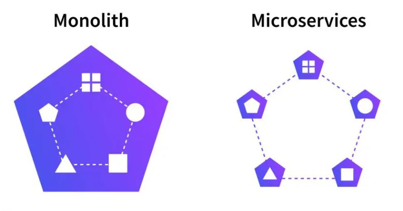

# Assignment 06 - Exploring The World!

## 1: What is `Microservice`?

- `Microservice` - also known as the microservice architecture.
- It is an architectural and organizational approach to software development where software is composed of small independent services like database, server or a UI of the application, that communicate over well-defined APIs. These services are owned by small, self-contained teams.
- Microservices architectures make applications easier to scale and faster to develop, enabling innovation and accelerating time-to-market for new features.
  means we are dividing software into small, well-defined modules enables teams to use functions for multiple purposes.

- Benefits of Microservices:

  - Flexible Scaling
  - Easy Deployment
  - Technological Freedom
  - Reusable Code
  - Resilience

- When to use Microservices architecture?
  - sometimes an application can outgrow its monolithic architecture and become an obstacle to rapid, frequent and reliable software delivery. This typically happens when the application becomes large and complex and is developed by many teams. For example, its deployment pipeline become a bottleneck. When this occurs, you should consider migrating to microservices.

## 2: What is `Monolith architecture`?

- A `Monolith architecture` is a traditional model of a software program, which is built as a unified unit that is self-contained and independent from other applications.
- A monolithic architecture is a singular, large computing network with one code base that couples all of the business concerns together.
- To make a change to this sort of application requires updating the entire stack by accessing the code base and building and deploying an updated version of the service-side interface. This makes updates restrictive and time-consuming.
- In short, monolith architecture builds all projects component in single large unit eg. database, ui, api etc. all in one project.

#### Difference between monolith and microservices architecture?

- While a monolithic application is a single unified unit, a microservices architecture breaks it down into a collection of smaller independent units.
- These units carry out every application process as a separate service. So, all the services have their own logic and databases, as well as perform specific functions.

## 3: What is the difference between `Monolith and Microservice`?

- With `monolithic architectures`, all processes are tightly coupled and run as a single service. This means that if one process of the application experiences a spike in demand, the entire architecture must be scaled. Adding or improving a monolithic application’s features becomes more complex as the code base grows. This complexity limits experimentation and makes it difficult to implement new ideas. Monolithic architectures add risk for application availability because many dependent and tightly coupled processes increase the impact of a single process failure.

- With a `microservices architecture`, an application is built as independent components that run each application process as a service. These services communicate via a well-defined interface using lightweight APIs. Services are built for business capabilities and each service performs a single function. Because they are independently run, each service can be updated, deployed, and scaled to meet demand for specific functions of an application.

- While a monolithic application is a single unified unit, a microservices architecture breaks it down into a collection of smaller independent units. These units carry out every application process as a separate service. So, all the services have their own logic and databases, as well as perform specific functions.



## 4: Why do we need a `useEffect Hook`?
.
- The Effect Hook is javascript function provided by `react`. This allows you to `perform side effects` in your components.
- Some examples of side effects are: `fetching API data`, `directly updating the DOM`, and `setting up subscriptions or timers` etc.
  useEffect accepts `two arguments`, a `callback function` and a `dependency array`. The second argument is optional.

```
> function Example() {
>   useEffect(() => {
>     //code
>   }, []);
> }
```

The `() => {}` is callback function and `[]` is called a empty dependency array.
If anything that we pass (suppose currentState) inside the `[]` it trigger the callback function and changes the state of the application.

```
> useEffect(() => {
>     setCurrentState("true");
> }, [currentState])
```

If we do not pass empty dependency array then the useEffect runs everytime when the UI is rendered.

```
> useEffect(() => {})
```

## 5: What is `Optional Chaining`?

The optional chaining (?.) operator accesses an object's property or calls a function. If the object accessed or function called using this operator is undefined or null, the expression short circuits and evaluates to undefined instead of throwing an error.

#### Example:

```
> const adventurer = {
>   name: 'Alice',
>   cat: {
>     name: 'Dinah'
>   }
>  };

> const dogName = adventurer.dog?.name;
> console.log(dogName);
> // Expected output: undefined

> console.log(adventurer.someNonExistentMethod?.());
> // Expected output: undefined
```

#### Syntax:

```
> obj.val?.prop
> obj.val?.[expr]
> obj.func?.(args)
```

- The ?. operator is like the . chaining operator, except that instead of causing an error if a reference is nullish (null or undefined), the expression short-circuits with a return value of undefined. When used with function calls, it returns undefined if the given function does not exist.
- This results in shorter and simpler expressions when accessing chained properties when the possibility exists that a reference may be missing. It can also be helpful while exploring the content of an object when there's no known guarantee as to which properties are required.
- For example, consider an object obj which has a nested structure. Without optional chaining, looking up a deeply-nested subproperty requires validating the references in between, such as:

```
> const nestedProp = obj.first && obj.first.second;
```

- The value of obj.first is confirmed to be non-null (and non-undefined) before then accessing the value of obj.first.second. This prevents the error that would occur if you accessed obj.first.second directly without testing obj.first.
- This is an idiomatic pattern in JavaScript, but it gets verbose when the chain is long, and it's not safe. For example, if obj.first is a Falsy value that's not null or undefined, such as 0, it would still short-circuit and make nestedProp become 0, which may not be desirable.
- With the optional chaining operator (?.), however, you don't have to explicitly test and short-circuit based on the state of obj.first before trying to access obj.first.second:

```
> const nestedProp = obj.first?.second;
```

- By using the ?. operator instead of just ., JavaScript knows to implicitly check to be sure obj.first is not null or undefined before attempting to access obj.first.second. If obj.first is null or undefined, the expression automatically short-circuits, returning undefined.
- This is equivalent to the following, except that the temporary variable is in fact not created.

```
> const temp = obj.first;
> const nestedProp =
>   temp === null || temp === undefined ? undefined : temp.second;
```

- Optional chaining cannot be used on a non-declared root object, but can be used with a root object with value undefined.

## 6: What is `Shimmer UI`?

- A shimmer UI resembles the page's actual UI, so users will understand how quickly the web or mobile app will load even before the content has shown up. It gives people an idea of what's about to come and what's happening (it's currently loading) when a page full of content/data takes more than 3 - 5 seconds to load.
- Shimmer UI enhances user experience of users who doesn't have to look at the loading spinner and wait all contents to suddenly appear on screen.

## 7: What is the difference between `JS expression and JS statement`?

- Expressions can be assigned or used as operands, while statements can only be declared.
- Statements create side effects to be useful, while expressions are values or execute to values.
  for example:
- Expression: a unit of code that resolves to a value, as instance, literals & operators. Examples for expressions:

```
> 1 + 2 // expresses
> "foo".toUpperCase() // expresses 'FOO'
> console.log(2) // logs '2'
> isTrue ? true : false // returns us a true or false value based on isTrue value
> 3
> 1 + 2
> "expression"
> fn()
> []
> {}
```

- Statement is a unit of code representing one instruction or more, usually starts with a language reserved keyword and ends, explicitly or implicitly, with a statement terminator. Examples of statements:
  for example:

```
> 3;
> let x = 3;
> if () { }
> for () {}
> while () {}
```

- If we want to use `JS expression` in JSX, we have to wrap in `{/* expression slot */}` and if we want to use `JS statement` in JSX, we have to wrap in `{(/* statement slot */)}`;


## 8: What is `Conditional Rendering`? explain with a code example.

- Your components will often need to display different things depending on different conditions. In React, you can conditionally render JSX using JavaScript syntax like if statements, &&, and ? : operators.for example:

```
> // Using Ternary operator as a shorthand way or writing an if-else statement
>
> {isLoggedIn ? (return <UserGreeting />) : (return <GuestGreeting />)};
// Using an if…else Statement
> {
>   (if (isLoggedIn) {
>     return <UserGreeting />;
>   }else {
>     return <GuestGreeting />;
>   })
> }
// Using Logical &&
> {isLoggedIn && <button>Logout</button>}
```

## 9: What is `CORS`?

- CORS (Cross-Origin Resource Sharing) is a system, consisting of transmitting HTTP headers, that determines whether browsers block frontend JavaScript code from accessing responses for cross-origin requests. The same-origin security policy forbids cross-origin access to resources.
- Cross-Origin Resource Sharing (CORS) is an HTTP-header based mechanism that allows a server to indicate any origins (domain, scheme, or port) other than its own from which a browser should permit loading resources.
  CORS defines a way in which a browser and server can interact to determine whether it is safe to allow the cross-origin request.
- Cross-origin resource sharing (CORS) is a browser security feature that restricts cross-origin HTTP requests that are initiated from scripts running in the browser. If your REST API's resources receive non-simple cross-origin HTTP requests, you need to enable CORS support.

#### Example:

domainy.com receives a request and it responds back with either:

- Access-Control-Allow-Origin: http://domainx.com.
- Access-Control-Allow-Origin: \* (meaning all domains are allowed)
- An error if the cross-origin requests are not allowed.


## 10: What is `async and await`?

- `Async`:
  - It simply allows us to write promises-based code as if it was synchronous and it checks that we are not breaking the execution thread. It operates asynchronously via the event loop.
  - Async functions will always return a promise. It makes sure that a promise is returned and if it is not returned then JavaScript automatically wraps it in a promise which is resolved with its value.
  - The async function declaration declares an async function where the await keyword is permitted within the function body. The async and await keywords enable asynchronous, promise-based behavior to be written in a cleaner style, avoiding the need to explicitly configure promise chains.

`Await`:

- await is usually used to unwrap promises by passing a Promise as the expression . Using await pauses the execution of its surrounding async function until the promise is settled (that is, fulfilled or rejected). When execution resumes, the value of the await expression becomes that of the fulfilled promise.
- Await function is used to wait for the promise. It could be used within the `async` block only. It makes the code wait until the promise returns a result. It only makes the async block wait.
- Await expressions make promise-returning functions behave as though they're synchronous by suspending execution until the returned promise is fulfilled or rejected. The resolved value of the promise is treated as the return value of the await expression.
- The await keyword is only valid inside async functions within regular JavaScript code. If you use it outside of an async function's body, you will get a SyntaxError.

#### Example:

```
> // async function getRestaurant to fetch Swiggy API data
>   async function getRestaurants() {
>     const data = await fetch(
>       "Swiggy_API_URL"
>     );
>     const json = await data.json();
>     // we get the Swiggy API data in json format
>     console.log(json);
>   }
```


## 11: What is the use of `const json = await data.json()`; in `getRestaurants()`?

- Data is a response from a fetched API So response.json() / data.json() is a method of the Response object that allows a JSON object to be extracted from the response.
- The method returns a promise, so you have to wait for the JSON: await data.json() .
- The Response object offers a lot of useful methods (all returning promises)
  - response.json() returns a promise resolved to a JSON object
  - response.text() returns a promise resolved to raw text
  - response.formData() returns a promise resolved to FormData
  - response.blob() returns a promise resolved to a Blob (a file-like object of raw data)
  - response.arrayBuffer()() returns a promise resolved to an ArryBuffer (raw generic binary data)
