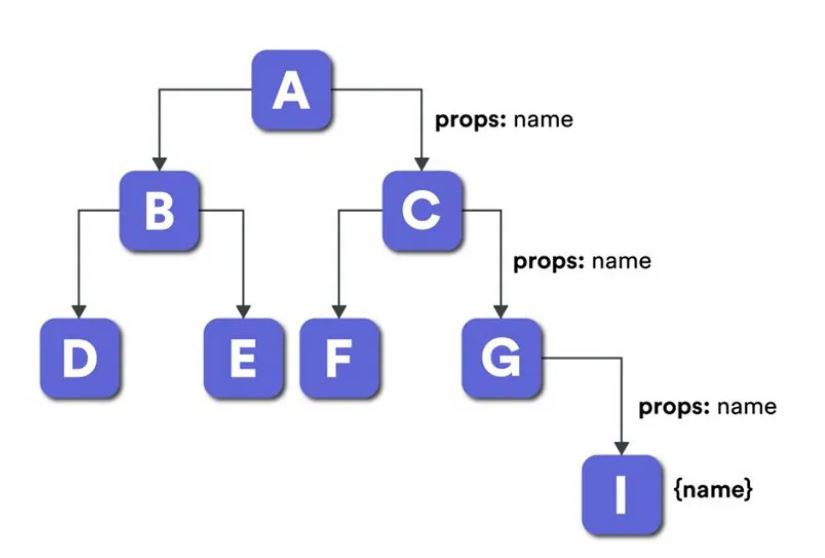

# Assignment 11 - Data Is The New Oil

## 1. What is prop drilling?

- In React, data is often shared between components using props.
- Prop drilling in react is the process of passing data from one component via several interconnected components to the component that needs it.
- The name drilling refers to this process of forcing these components to take in unnecessary data and pass it on to the following component, which in turn sends it on to the next component, and so on until it reaches its intended destination. The reusability of components and app performance may suffer as a result in a significant way.
- It is not a good idea to pass data via several components when building neat, reusable, and DRY code.
- Prop drilling in react is sometimes advantageous for smaller apps since there are lesser components and conditions to control.

### Example:

```
App.js
  |
Login Page {username:"Shweta Garbhe"}
  |
Dashboard {username:"Shweta Garbhe"}
  |
Profile {username:"Shweta Garbhe"}

```

Refer Below image to undertand Props Drilling in pictorial format.


## 2. What is lifting the state up?

- In React, each component has its state. Lifting the state up is a valuable concept for React developers since we often have a state that is accommodated within a single component but needs to be shared with its siblings. We lift the state up to make the parent state a single shared state and a sole "source of truth" and pass the parent's data to its children.
  This concept is called lifting state up. It is of great use to maintain data consistency in our react applications.
- Many times, multiple components must reflect the same changing data. And if the data is not in sync between the "parent and children components" or "cousin components," it is recommended to lift the shared state up to the closest common ancestor.
- It's better to have a single "source of truth" for any changing data in our react application. We often have a state contained within a single component but needs to be shared with siblings. In such cases, we can use the lifting of state up.
- Rather than using a full-fledged state management framework like Redux or React Context, we can lift the state up to the next common ancestor and transmit the state variables, state values, and any callbacks to change that state down. Using this method also reduces bugs' surface area and makes it easier to implement any custom logic

## 3. What is Context Provider and Context Consumer?

**Context.Provider :**

- Every Context object comes with a Provider React Component that allows consuming components to subscribe to context changes.
- The Provider components takes a value prop to be passed to consuming components that are descendants of this provider. One provider can be connected to many consumers. Providers can be nested to override values deeper within the tree.

- All consumers that are descendants of a Provider will re-render whenever the Provider's value prop changes.

```
<MyContext.Provider value={/* some value */}>
```

**Context.Consumer:**

- It is a React Component that subscribes to context changes.
- Using this component lets you subscribe to a context within functional component.
- It requires a function as a child. The funtion receives the current context value and returns a React node. The value argument passed to the function will be equal to the value prop of the closest Provider for this context above in the tree.
- If there is no Provider for this context above, the value argument will be equal to the defaultValue that was passed to createContext().

```
<MyContext.Consumer {value =>  render something based on the context value }></MyContext.Consumer>
```

## 4. If you don't pass a value to the provider does it take the default value?

Yes, it will take a default value.
But passing undefined as a Provider value does not cause consuming components to use defaultValue.
